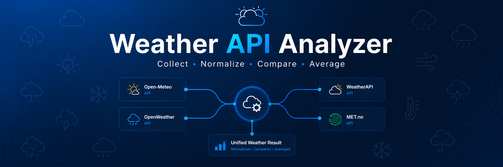

<p align="center">
  
</p>

# Weather API Analyzer

- [Русский](#русский)
- [English](#english)

---

# Русский

## Описание

Небольшое приложение на PHP для получения и объединения данных о погоде с нескольких сервисов.

Программа получает погоду для указанного города, приводит данные всех сервисов к единому виду и выводит:

- текущую среднюю температуру;
- текущую погоду в процентах (по количеству источников);
- прогноз на следующий день (09:00, 12:00, 15:00 и 18:00).

Используемые API:

- Open-Meteo
- OpenWeather
- WeatherAPI
- Norway Meteorological Institute

---

## Основные возможности

### 1. Настройки

- включение/отключение отдельных API;
- русский и английский язык.

### 2. Telegram Bot

Бот использует Telegram Long Polling.

Команды:

- `/start` — информация о боте;
- `/wc` — список команд;
- `/allw <город>` — текущая погода + прогноз на завтра;
- `/cw <город>` — только текущая погода;
- `/ndw <город>` — только прогноз на завтра.

### 3. Консоль

Можно выбрать режим работы:

- вывод в консоль;
- сохранение результата в JSON;
- вывод + сохранение одновременно.

### 4. Логирование

Все ошибки записываются в:

```
error_log.txt
```

### 5. Запуск

Windows

```
start_console[WINDOWS].bat
start_bot[WINDOWS].bat
```

Linux

```
start_console[LINUX].sh
start_bot[LINUX].sh
```

---

## API ключи

### OpenWeather / WeatherAPI

Укажите свои ключи в файле:

```
Params.php
```

```php
OPEN_WEATHER_KEY
WEATHER_API_KEY
```

Для Open-Meteo и Norway Meteorological Institute ключи не требуются.

> В проекте сейчас используются временные ключи. Для постоянной работы рекомендуется получить собственные API-ключи.

---

## Telegram Bot

Откройте файл

```
bot/Bot.php
```

и замените

```php
API_KEY = 'TG BOT TOKEN HERE';
```

на токен своего Telegram-бота.

---

## Требования

Для работы необходимы:

- PHP 8+
- расширение cURL;
- включённый cURL в php.ini.

---

## Примеры

Все примеры находятся в папке:

```
examples/
```

- `allw.txt` — команда `/allw`;
- `cw.txt` — команда `/cw`;
- `ndw.txt` — команда `/ndw`;
- `json_raw.json` — пример JSON.

---

# English

## Description

A small PHP application that collects weather data from multiple providers and combines it into a single forecast.

The application retrieves weather information for a selected city, converts data from different APIs into a common format and displays:

- current average temperature;
- current weather percentage based on available providers;
- forecast for the next day (09:00, 12:00, 15:00 and 18:00).

Used APIs:

- Open-Meteo
- OpenWeather
- WeatherAPI
- Norway Meteorological Institute

---

## Features

### 1. Configuration

- enable/disable individual weather APIs;
- Russian and English language support.

### 2. Telegram Bot

The bot uses Telegram Long Polling.

Commands:

- `/start` — bot information;
- `/wc` — list of commands;
- `/allw <city>` — current weather + next day forecast;
- `/cw <city>` — current weather only;
- `/ndw <city>` — next day forecast only.

### 3. Console

Available modes:

- print to console;
- save result as JSON;
- both at the same time.

### 4. Logging

Runtime errors are written to:

```
error_log.txt
```

### 5. Running

Windows

```
start_console[WINDOWS].bat
start_bot[WINDOWS].bat
```

Linux

```
start_console[LINUX].sh
start_bot[LINUX].sh
```

---

## API Keys

### OpenWeather / WeatherAPI

Add your API keys to:

```
Params.php
```

```php
OPEN_WEATHER_KEY
WEATHER_API_KEY
```

Open-Meteo and Norway Meteorological Institute do not require API keys.

> Temporary API keys are included in the project. It is recommended to replace them with your own.

---

## Telegram Bot

Open

```
bot/Bot.php
```

and replace

```php
API_KEY = 'TG BOT TOKEN HERE';
```

with your own Telegram bot token.

---

## Requirements

- PHP 8+
- cURL extension;
- cURL enabled in php.ini.

---

## Examples

Example outputs are located in:

```
examples/
```

- `allw.txt`
- `cw.txt`
- `ndw.txt`
- `json_raw.json`
